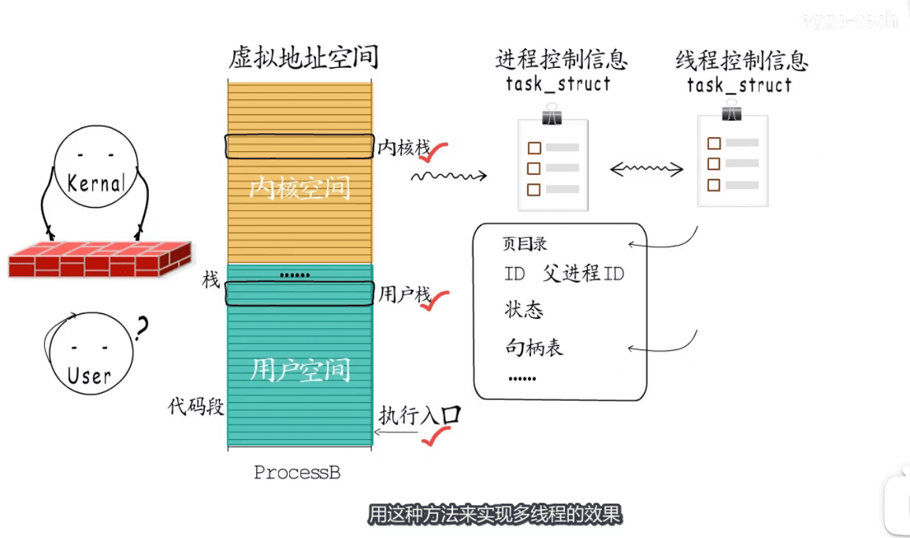
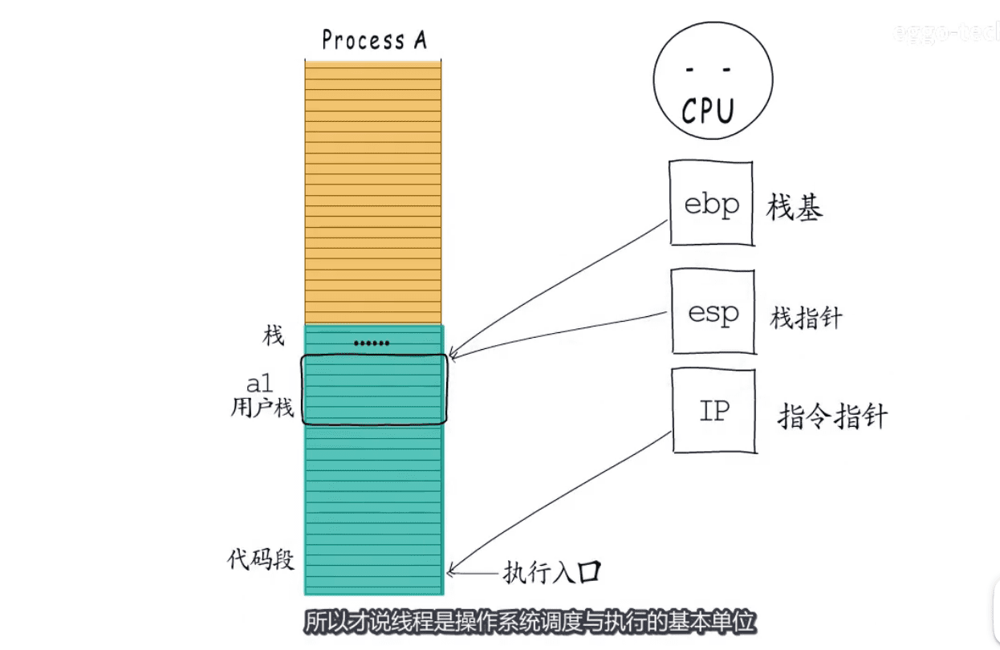
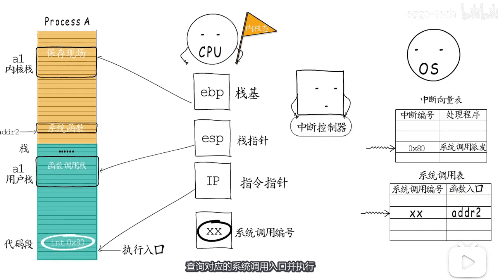
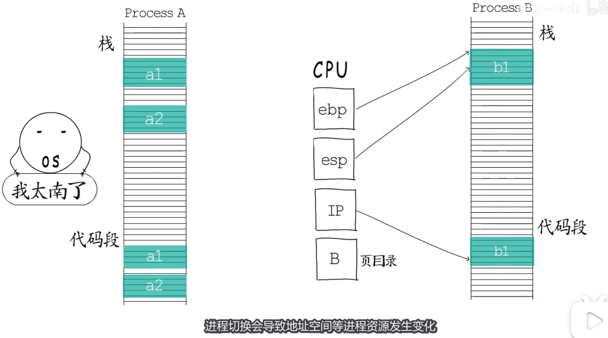

* 内核空间是所有线程共用的虚拟地址空间 
* linux 中是用task_struct 结构体实现多线程效果 `表示PCB => TCL`
* 

* `栈基ebp` `栈指针`esp `指令指针IP` 所以说线程是操作系统调试执行的基本单位
* 

* 操作系统提供的服务: `虚拟内存分配` `文件操作` `网络读写`
* 如何调用到操作系统? `切换到内核态`
* `软中断`  `syscall`
* 

* `同进程的线程切换` `不同进程线程切换` 
* 进程切换和线程切换的区别
* 

[图片来源视频](https://www.bilibili.com/video/BV1H541187UH)

