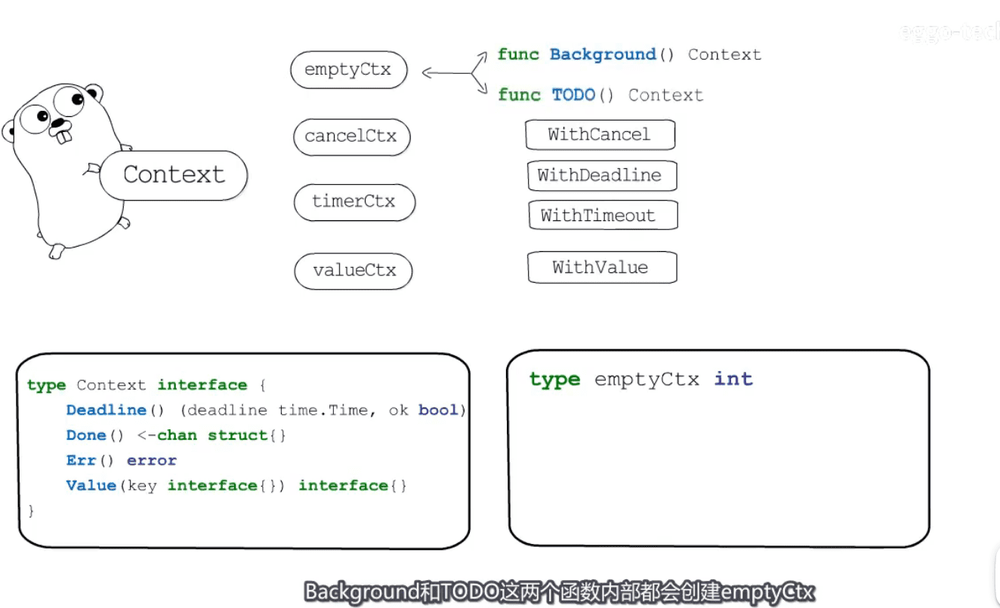

* 传递 `截止时间` `取消信号`  `请求相关数据`
* 

## 一句话总结

* 一个接口 
* 四种具体实现  
* 六个函数

* 两个函数: background todo

* 
* cancelCtx 结构体
* 

* timeCtx结构体
* 

* 实例timeCtx, 一棵context树
* 

* valueCtx结构体,通过context传递信息
* 

* 

* 用自定义类型包装key

* 

* 应用场景 http sql 库中 `超时自动取消` `传递请求相关数据`
* 

* 实战示例 https://www.jianshu.com/p/6def5063c1eb
* 

[图片来源视频](https://www.bilibili.com/video/BV19K411T7NL)
