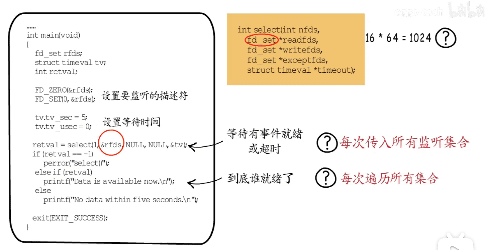
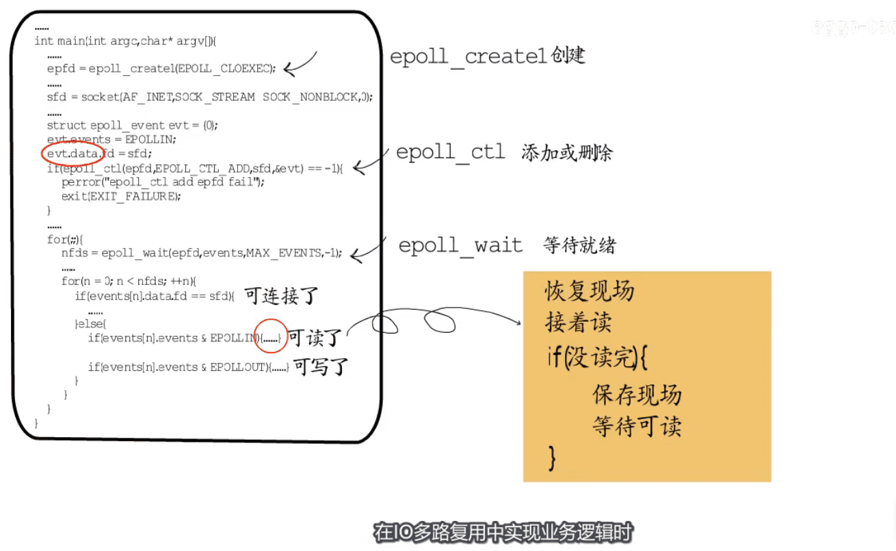
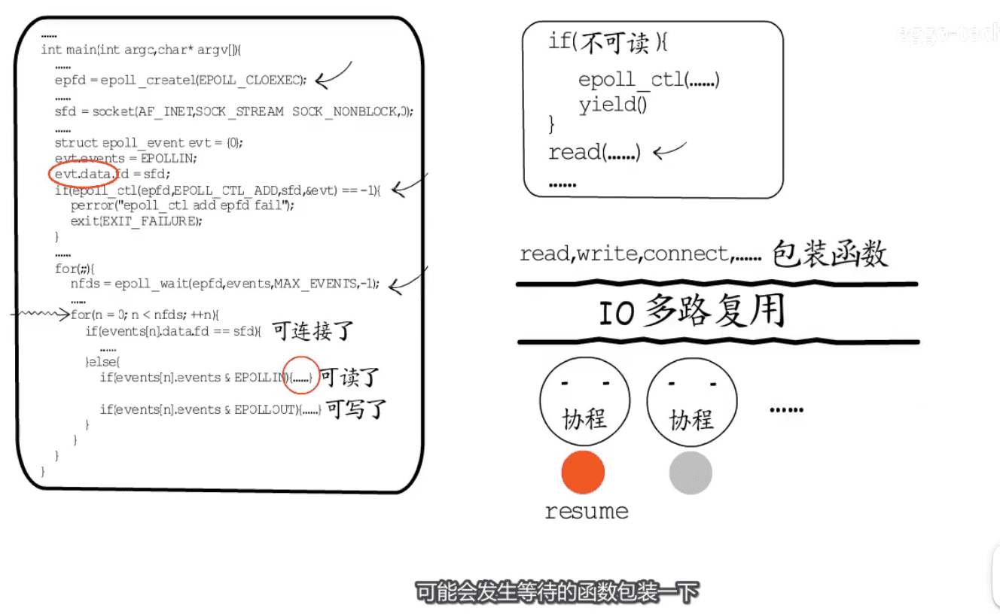

* 典型的io复用场景,   sock到来时,文件描述符表+1

* 

* 如果使用阻塞式io, 一个sock要对应一个线程 `线程调度成本高` `切换到内核`
* 

* 


* Linux 三种io复用模式  `select(1024)` `poll`  `epoll`
* 
* select/poll 存在的问题  `内核态用户态切换` `接口需要遍历所有才能判断谁准备就绪了`

* 业务逻辑  epoll 频繁的`保存恢复现场`
* 

* io多路复用与具体的业务逻辑解耦  
* 


io复用代码c语言  select poll epoll
``` bash
# 本地代码路径: 
cd /Users/hfb/projects/c-c++/tcp-server-client/
# ubuntu110设备:  
cd /home/hfb/projects/c-c++/tcp-server-client
```


[图片来源视频](https://www.bilibili.com/video/BV1a5411b7aZ)

