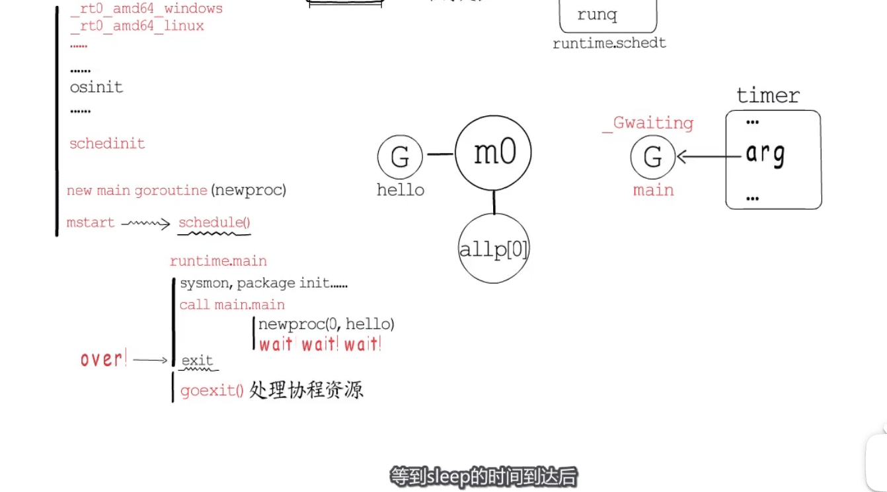

* 程序入口 runtime.main=>main.main   
* 

* 几个重要的全局变量  `runtime.g` runtime.m
* 最开始的go,,,只有G,M   =>  GPM
* 

* 

```  go
func hello(){
  fmt.println("hello")
}

func main(){
  go hello()
}

```


*  让hello goroutine 执行,不能让main调用exit
* 

* 


[图片来源视频](https://www.bilibili.com/video/BV1Ky4y1r78H)

