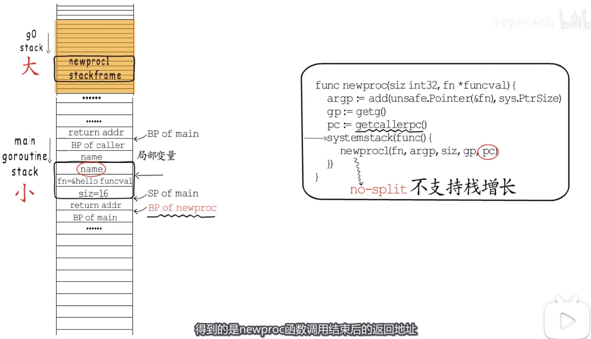
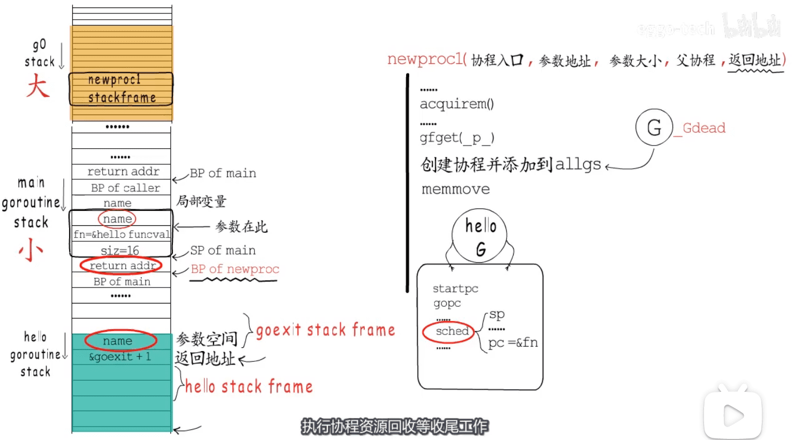
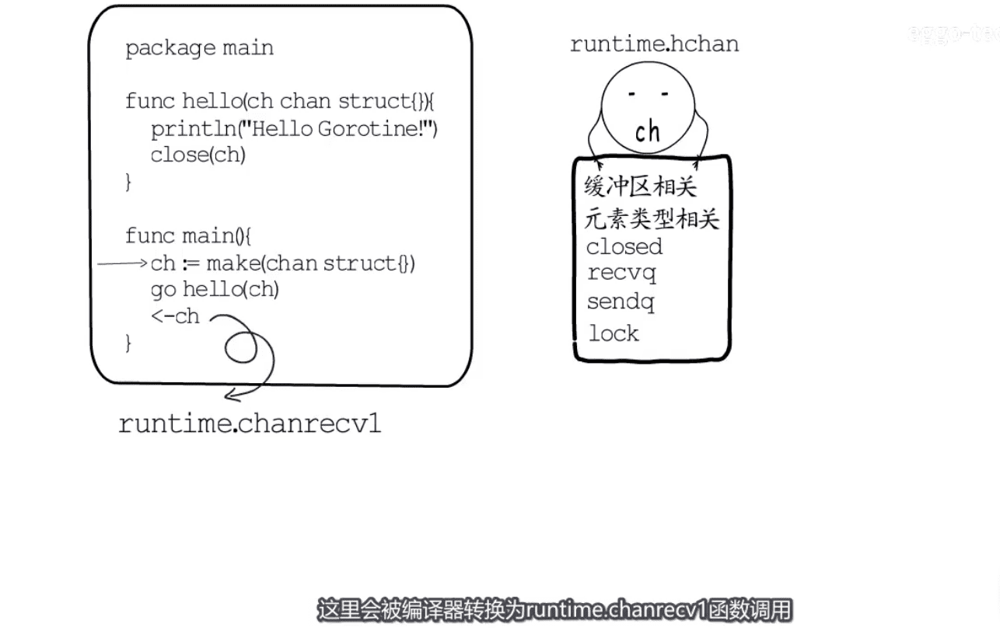
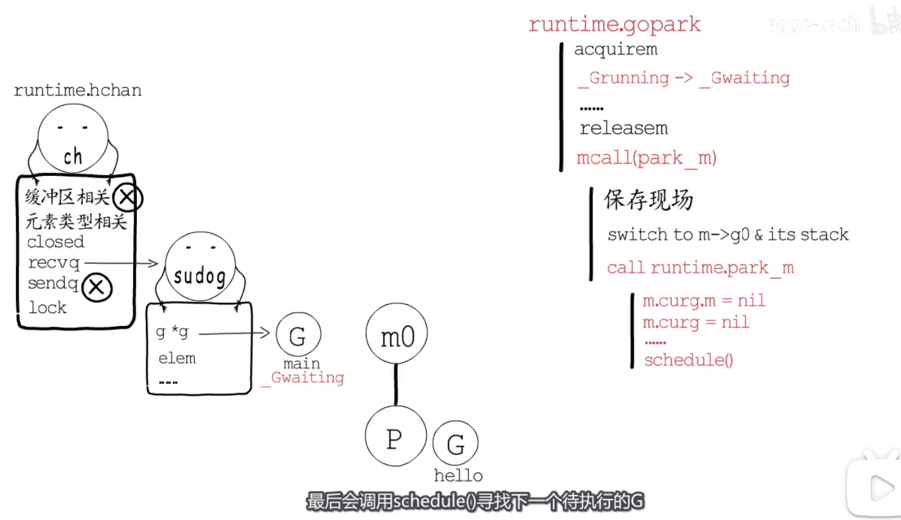
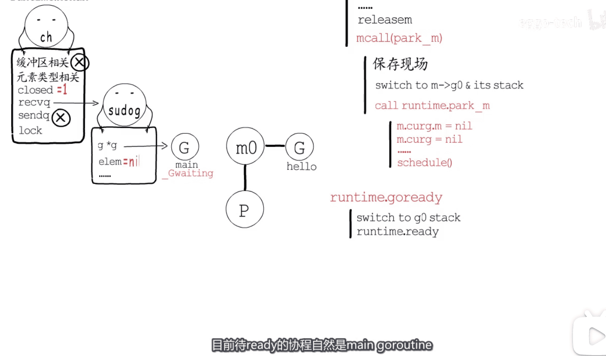
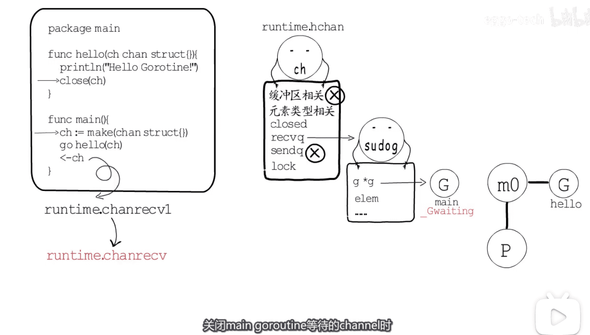

* 不支持`栈增长`协程

* 

* 

* 编译器会为函数调用插入运行时检查`runtime.morestack`，它会在几乎所有的函数调用之前检查当前`goroutine` 的栈内存是否充足，如果当前栈需要扩容，会调用`runtime.newstack` 创建新的栈：

* [栈扩容,栈缩容原文](https://blog.csdn.net/kevin_tech/article/details/108989276)  `代码如下`

* ``` bash
  cat /Users/hfb/projects/go/gopath/src_only_mod_copy/gopl.io/a_for_test/go_stack_add/main.go
  ```

* 协程同步对应的结构体

* 

* 协程等channel时会做如何处理,触发协程切换
* 

* 当子协程关闭channel时,main 协程的恢复过程
* 

* 


[图片来源视频](https://www.bilibili.com/video/BV1MZ4y1V7SP)

