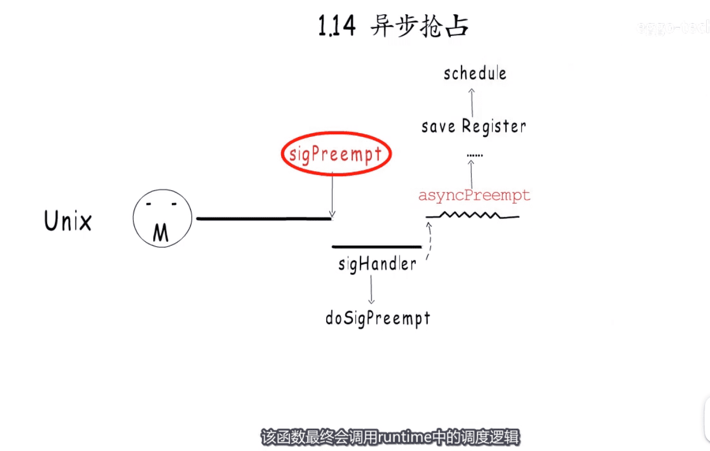

* 谁触发定时器注册的回调函数?
* 

* 如何解决timer执行时间有较大的偏差的问题?  `监控线程`
* 

* 协程等待场景  `hchan` `epoll`
* 

* 公平调度 `抢占`
* 

* 怎么通知?协程调度  `栈增长代码`  三种类型  
* 

* 抢占用的特殊标识  stackPreempt
* 1.14版本中 异步抢占 解决 for{} 不用到栈增加逻辑 卡死  `办法:注入代码`
* 

* 抢占处在系统调用中的P g0栈 

* 

* sechedule 获取协程 步骤1 `看全局列表`
* 

* 步骤2 `netpoll` 尝试恢复等待的协程
* 

* 步骤3 `steal from other P`
* 步骤4 协程是否有绑定的M

[图片来源视频](https://www.bilibili.com/video/BV1zT4y1F7XF