* 分配在堆上的数据 
* "悬挂指针"问题
* 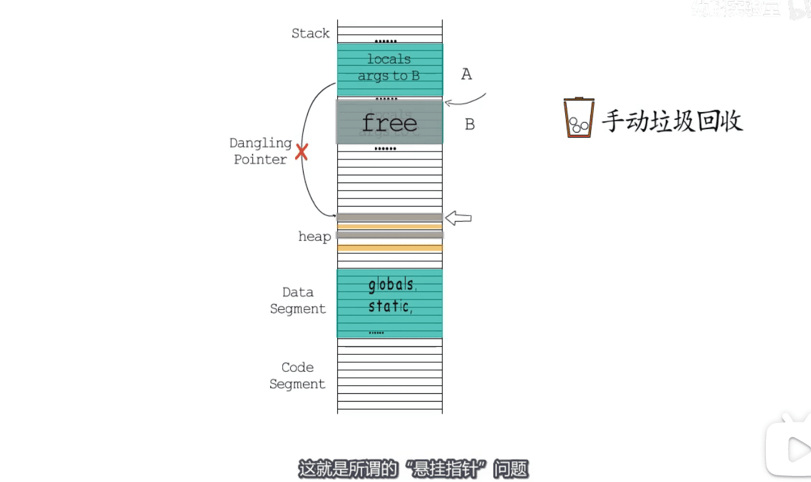
* 越来越多语言=>自动垃圾回收   
* 主流垃圾回收算法 : `可达性` 近似 `存活性`
* 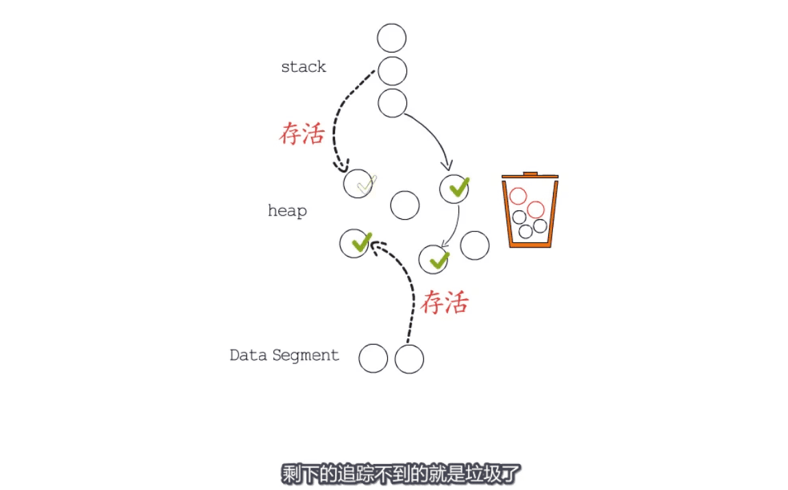

* 三色抽象算法  `堆区` `栈区`  25%cpu目标消耗 
* 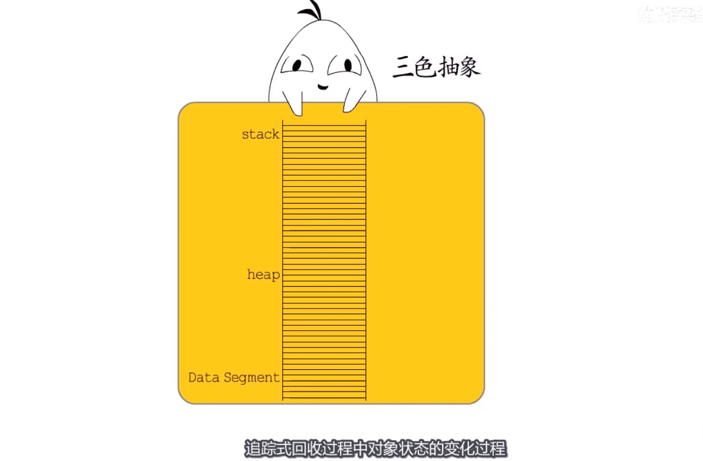
* 步骤1: root能标记到的节点为灰色 `灰色:当前节点展开的追踪还未完成`
* 
* 步骤2:   把已完成的追踪标记为黑色  `黑色:已完成,无需再基于它再次进行追踪`
* 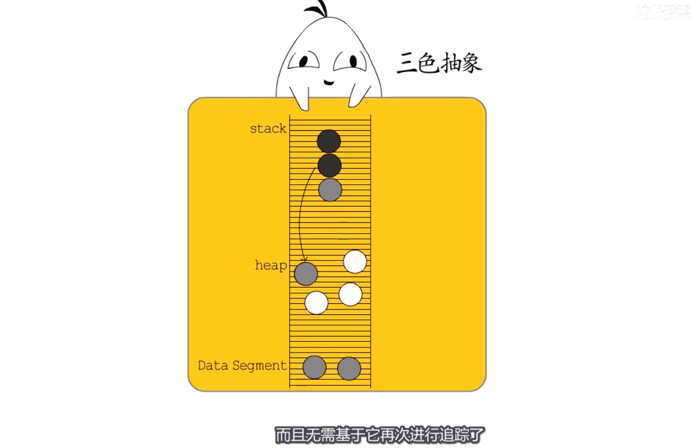

* 步骤3: 当不存在灰色节点时,标记工作可以结束了
* 步骤4:白色节点为垃圾可以回收
* 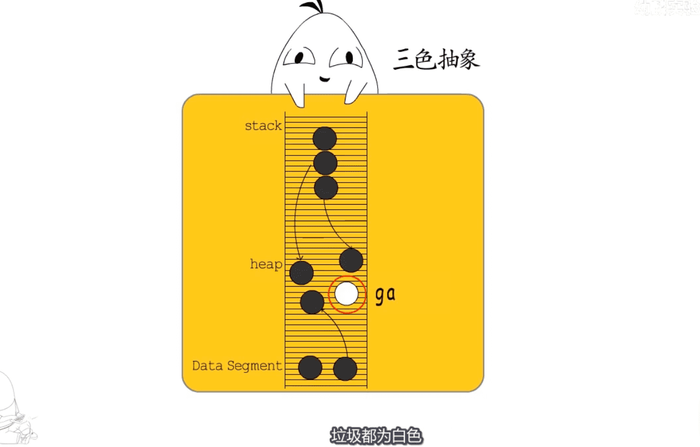

*   内存碎片化问题? 
* 方案1:如何解决  `bibop(Big Bag Of Pages)`
* 

* 方案2:   `标记压缩`  `复制式回收`
* 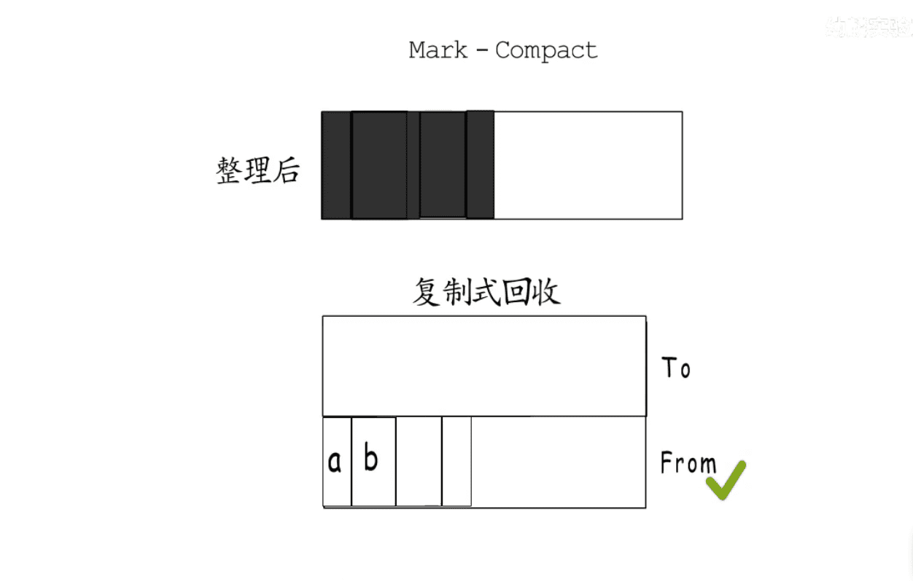

* 方案3:分代回收 : 一种复制式回收的优化
* 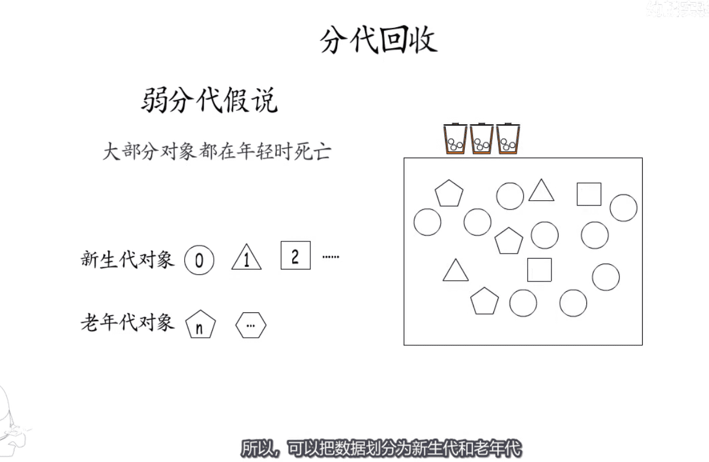

* 引用记数垃级回收
* 垃圾回收优化:  STW: stop the world   `防止性能抖动`
* `三色:垃圾回收 读写屏障`  实现 强/弱三色不变式的通常做法
* 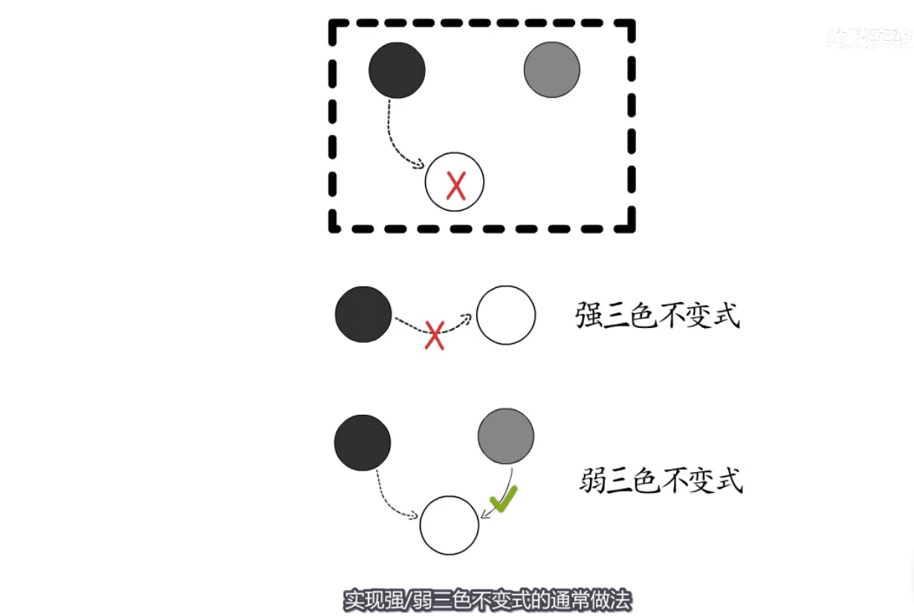

* 什么是写屏障? `写操作中插入指令`  具体实现有一个记录集
* 

* 读写屏障混用
* 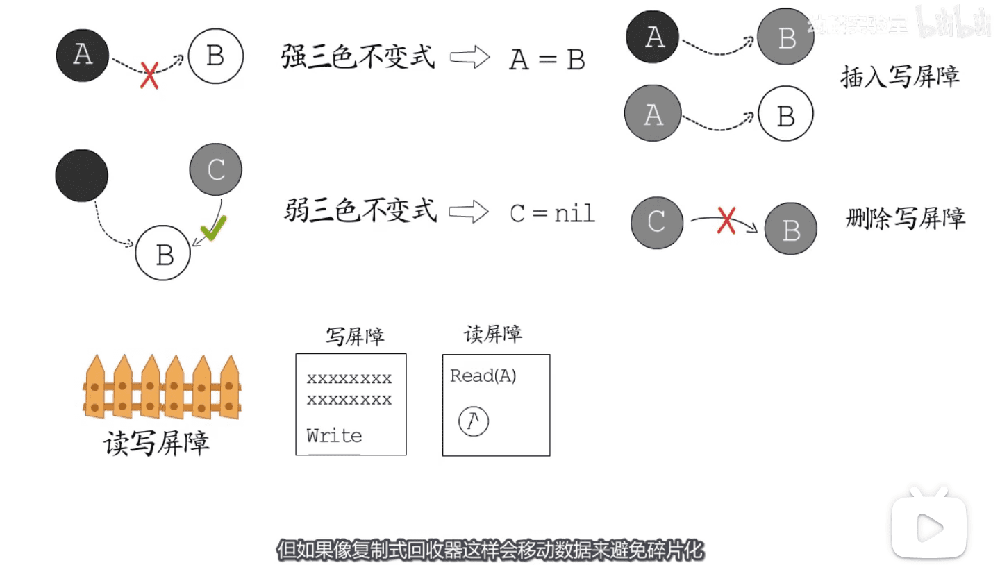

* `并发垃圾回收`  `主体并发式回收` `主体并发增量式`
* 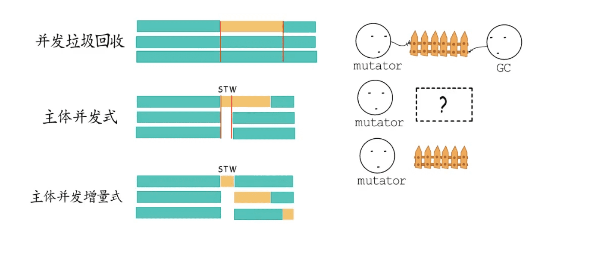

* 概括:    `概念`  `算法核心思想`  `运行模式`

* Go语言采用的是  `标记-清扫算法` `主体并发增量式` `插入与删除的混合写屏障`
* 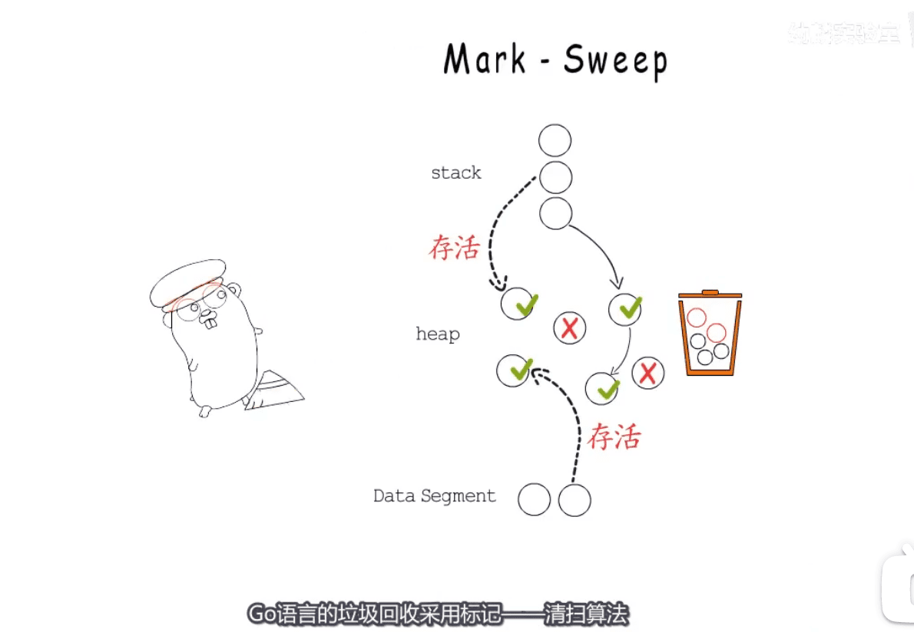

[图片来源视频](https://www.bilibili.com/video/BV1n5411H7qS)

