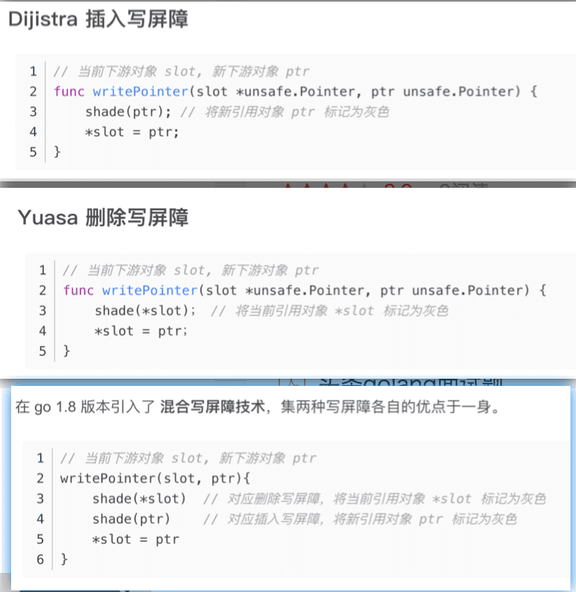

## Go语言的实现:  `标记-清扫算法` `主体并发增量式` `插入与删除的混合写屏障`
  * 

## 问题的提出: "悬挂指针"问题 和手动垃圾回收
  * 分配在堆上的数据 
  * 

## 问题的解决思路: 越来越多语言=>自动垃圾回收   
  * 主流垃圾回收算法 : `可达性` 近似 `存活性`
    * 引用计数 当对象被创建或被其他对象引用时，计数 +1；如果引用该对象的对象被销毁时，计数 -1 ；当计数为 0 时，回收该对象。
      * 优点：对象可以很快被回收，不会出现内存耗尽或到达阀值才回收。
      * 缺点：不能很好的处理循环引用；需要实时维护计数引用。
    * 标记-清除：从根变量开始遍历所有引用的对象，引用的对象会被标记，没有被标记的则进行回收。
      * 优点：解决了引用计数的缺点；
      * 缺点：需要 STW（stop the world），暂时停止程序运行。
    * 分代收集：按照对象生命周期长短划分不同的代空间，生命周期长的放入老年代，短的放入新生代，不同代有不同的回收算法和回收频率。
      * 优点：回收性能好；
      * 缺点：算法复杂。
  * 

## `标记清除思路`引出三色抽象算法
  * 三色是哪三色,对应状态如何
    * `白色：` 未搜索的对象，在回收周期开始时所有对象都是白色，在回收周期结束时所有的白色都是垃圾对象
    * `灰色：` 正在搜索的对象，该类对象可能还存在外部引用对象
    * `黑色：` 已搜索完的对象，这类对象不再有外部引用对象
  * 1、初始状态下所有对象都是 白色 的；
  * 2、从 根节点对象 开始遍历所有对象，把遍历到的对象变成 灰色，放入待处理队列； `bss段区` `栈区`
  * 3、遍历所有灰色对象，将遍历到的灰色对象变成 黑色，同时将它引用的对象变成灰色并加入到待处理队列；
  * 4、循环步骤3，直到 待处理队列为空（所有灰色对象都变为黑色）；
  * 5、剩下没有被标记的 白色 对象就认为是垃圾对象。

## 算法的工程学问题: `标记-清扫算法` STW: stop the world 
  * `插入与删除的混合写屏障`
  * `主体并发增量式` 

## go实现细节: `插入与删除的混合写屏障`
  * gc回收过程中 不能出现被错误的清除 
    * 等价于 `用户程序并发的修改了对象引用关系，而且，修改的引用关系` 满足以下条件
      * 1,黑色对象引用了白色对象；
      * 2,该白色对象没有被其他灰色对象引用 或者 灰色对象与它之间的可达关系遭到破坏。
    * 引入概念
      * 强三色不变式：黑色节点不允许引用白色节点，破坏了条件一。
      * 弱三色不变式：黑色节点允许引用白色节点，但是该白色节点必须有其他灰色节点的引用或间接引用，破坏了条件二。
  * Dijistra 插入写屏障
    * 在 堆对象 增加引用对象的时候，先把该引用对象置为 灰色
    * 缺点
      * 1,栈空间对象是没有写屏障的，因此，在标记过程中，可能出现 黑色的栈对象 引用到 白色对象 的情况，所以在一轮三色标记完成后 需要开启 STW，重新对 栈上的对象 进行三色标记。
  * Yuasa 删除写屏障
    * 被删除的对象，如果自身为灰色，则不用处理，如果为白色，那么将该对象标记为灰色
    * 缺点：
      * 1,回收精度低,要待到下轮 gc 才可以被清除
      * 2,必须在 gc 开启时执行 STW，扫描根集合，保证所有堆上在用的对象要么为灰色，要么处于灰色保护下，即保证 根黑，下一级在堆上的全灰。
  * 混合写屏障 `针对 栈区 和 堆区 分别采用以下策略处理`
    * 栈区
      * 1,栈上对象全部扫描标记为黑色（每个栈单独扫描，无需 STW 整个程序，停止单个扫描栈即可）
      * 2,GC 期间，任何在栈上创建的新对象，均为黑色（不用再对栈重新扫描）
    * 堆区
      * 1,被删除的对象标记为灰色（删除写屏障）
      * 2,被添加的对象标记为灰色（插入写屏障）
    * 

  * gc 触发时机
    * gcTriggerHeap：堆内存的分配达到控制器计算的触发堆大小，初始大小环境变量 GOGC，之后堆内存达到上一次垃圾收集的 2 倍时才会触发GC；
    * gcTriggerTime：距离上一次垃圾回收超过一定阈值时，该时间由 runtime.forcegcperiod 变量控制，默认为 2 分钟。
    * gcTriggerCycle: 要求启动新一轮的GC, 已启动则跳过, 手动触发GC的runtime.GC()会使用这个条件。

[资料参考](https://blog.csdn.net/LIFE_PLAN/article/details/124003001)

[图片来源视频](https://www.bilibili.com/video/BV1n5411H7qS)

