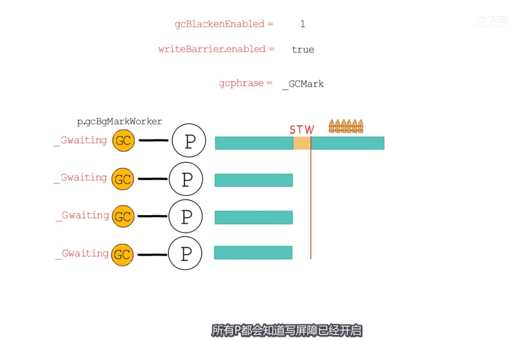
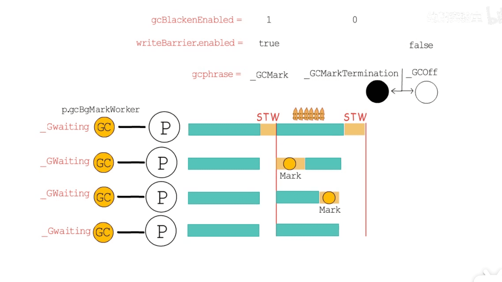
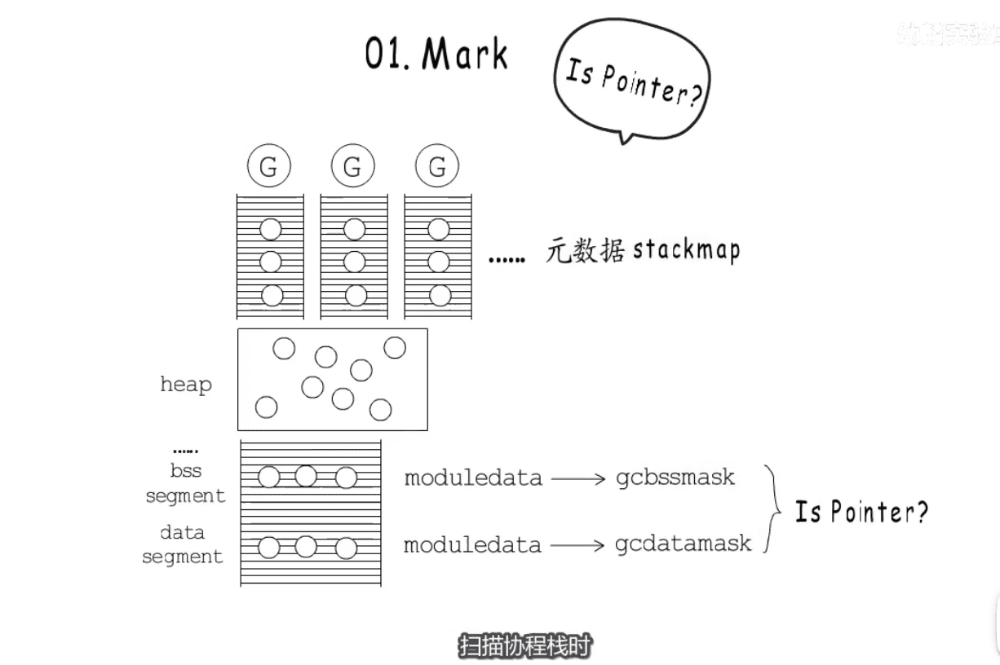
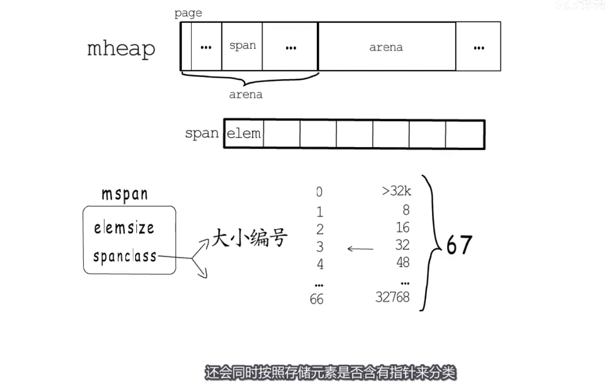
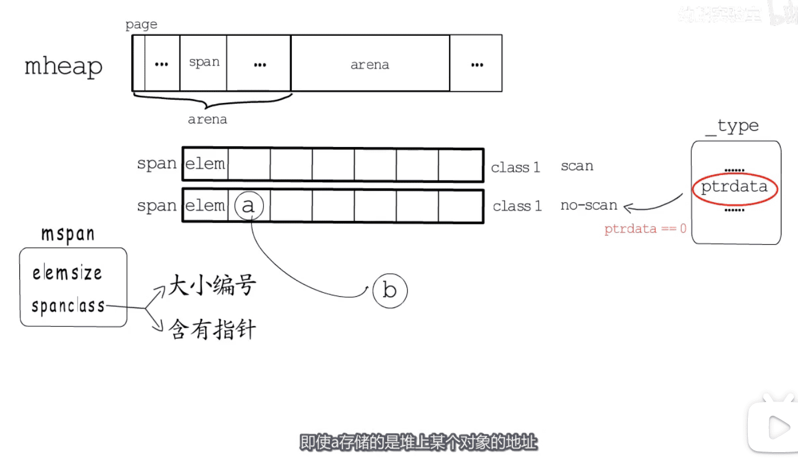
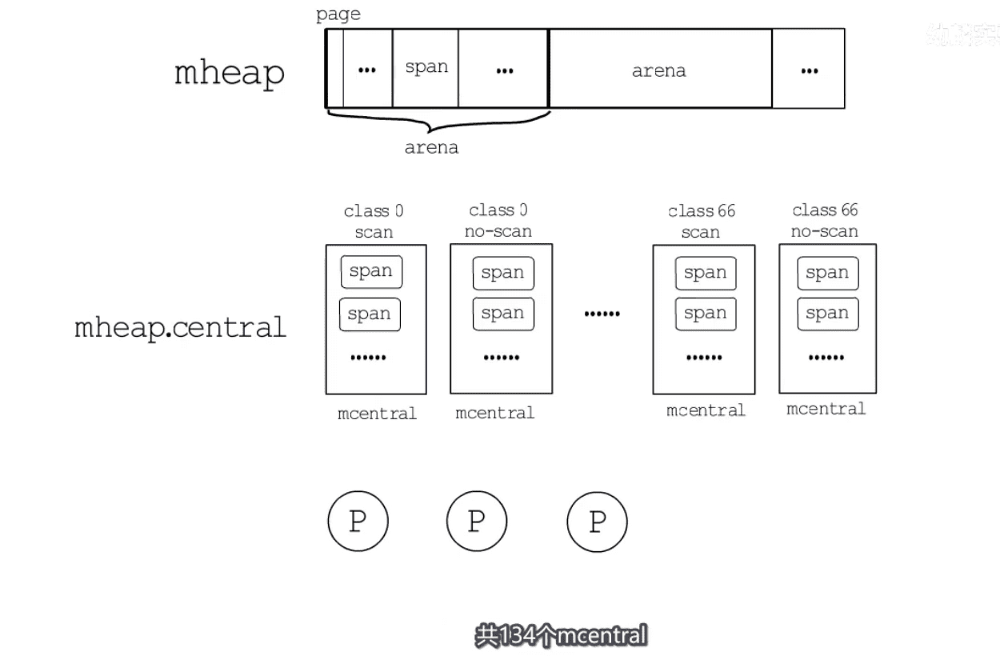
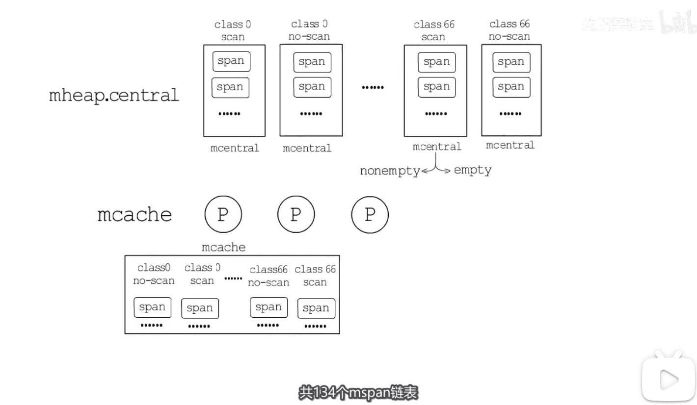
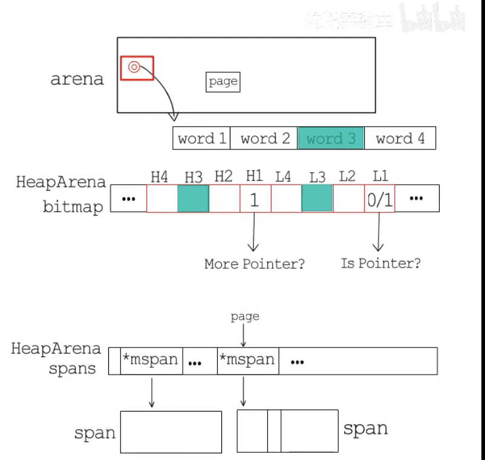
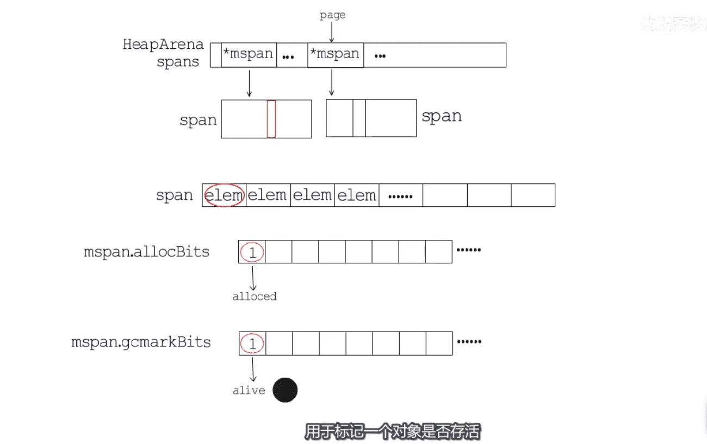
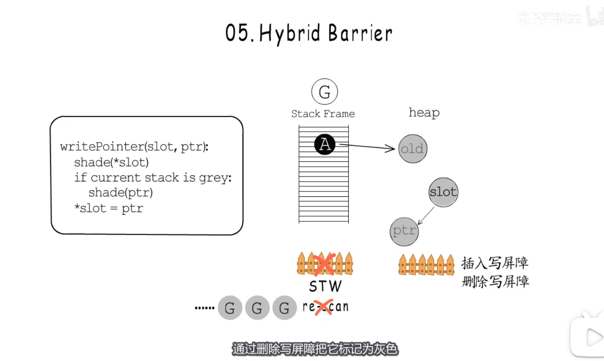

* go垃圾回收实现  数字:25%cpu消耗作为目标
* 

* 结束时间点
* 

* 标记工作
* 步骤1: 扫描`bss段`,`数据段`,` `协程栈` 上 root节点开始
* 步骤2:如何确定指针是  GC  感兴趣的?  `元数据`    `扫描协程栈-局部变量,参数,返回值,stackmask` `编译到可执行文件有gcbssmask,gcdatamask`
* 

* 步骤3: 判断指针是否指向 `堆内存` ? 如果是则加入到GC工作队列中
* mheap 结构如下   `管理着虚拟地址空间中一大段连续的内存`  `8k为一个页,多个页组成一个span`  `多个span组成arena` 

* `每个span只存储一种大小的元素`   `mspan`    `elemsize`  `spanclass` 

* 

* _type类型元数据  `ptrdata标识是否有指针`  `scan` `no-scan`

* 

* 同步开销问题  => `central` `local - 以P为单位`
* 

* `nonempty span`  `empty span`  进行分别管理
* 以P为单位管理内存申请 ,  区别  central 进行申请内存

* 

* 有哪些`GC`用得到的`元数据信息`
* 1:1  arena=>HeapArena  `一个字节标记连续4个指针大小的内存`  
* `bitmap`  `spans`  

* 

* mspan 结构体有哪些GC关心的数据  `判断对象是否存活`  `通过位图进行一对一标记`  
* 

* 混合写屏障
* 

## Linux可执行进程对应的虚拟地址空间的五个段

* BSS段：BSS段（bss segment）通常是指用来存放程序中未初始化的全局变量的一块内存区域。BSS是英文Block Started by Symbol的简称。BSS段属于静态内存分配。
* 数据段：数据段（data segment）通常是指用来存放程序中已初始化的全局变量的一块内存区域。数据段属于静态内存分配。
* 代码段：代码段（code segment/text segment）通常是指用来存放程序执行代码的一块内存区域。这部分区域的大小在程序运行前就已经确定，并且内存区域通常属于只读, 某些架构也允许代码段为可写，即允许修改程序。在代码段中，也有可能包含一些只读的常数变量，例如字符串常量等。
* 堆（heap）：堆是用于存放进程运行中被动态分配的内存段，它的大小并不固定，可动态扩张或缩减。当进程调用malloc等函数分配内存时，新分配的内存就被动态添加到堆上（堆被扩张）；当利用free等函数释放内存时，被释放的内存从堆中被剔除（堆被缩减）若程序员不释放，则会有内存泄漏，系统会不稳定
* 栈(stack)：栈又称堆栈， 是用户存放程序临时创建的局部变量，也就是说我们函数括弧“{}”中定义的变量（但不包括static声明的变量，static意味着在数据段中存放变 量）。除此以外，在函数被调用时，其参数也会被压入发起调用的进程栈中，并且待到调用结束后，函数的返回值也会被存放回栈中

[图片来源视频](https://www.bilibili.com/video/BV1Ui4y1F7n3/?spm_id_from=autoNext)

