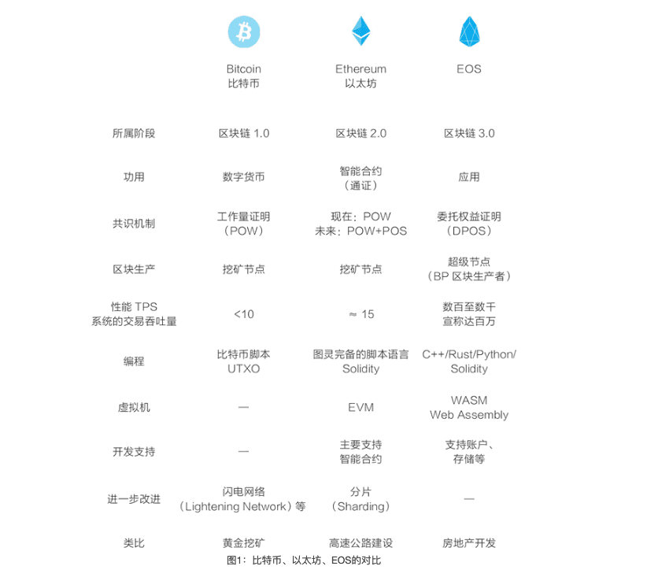

[POW、POS、DPOS三种基础共识机制快速理解](https://www.data100.net/16414.html)

::: tip POW：Proof of Work，工作量证明
:::
* POW必须通过一定的工作量，来获得相应的奖励。它要求矿工进行数学运算来获取记账权和新币，以耗费大量时间、资源为担保，确保记账工作的真实有效性。
* POW是一种多劳多得的模式。算力越高、挖矿时间越长，获得的数字货币就越多。如果某个节点拥有全网40%的算力，那么该节点理论上拥有40%的概率，在POW中获胜。
* 谁使用POW？ BTC和BTC的儿子们（BCH、BCD等等），ETH（将要转换成POS），LTC。

::: tip POS：Proof of Stake，权益证明
:::
* 引入一个概念:币龄
* 谁使用POS？ 未来ETH

::: tip DPOS：Delegated Proof of Stake，委任权益证明
:::
* DPOS就像董事会投票，持币者投出一定数量的节点 （董事）。代表按照既定时间表，轮流产生区块，如果代表没能很好的行使权力（比如产生区块），他们会被除名，网络会选出新的超级节点来取代他们。所有的代表将收到平均水平区块所含交易费的10%作为报酬。
`产生区块`代表了一定的能力
* 谁使用DPOS？ BTS， EOS，GXC。

编程:

* UTXO (*UTXO*(Unspent Transaction Outputs)是未花费的交易输出,它是比特币交易生成及验证的一个核心概念)
* Solidity  (*Solidity* 是 Ethereum 的一种契约型编程语言，其语法与 JavaScript 类似，并且旨在定位到以太坊虚拟机)
* C++/Rust/Python/Solidity 

