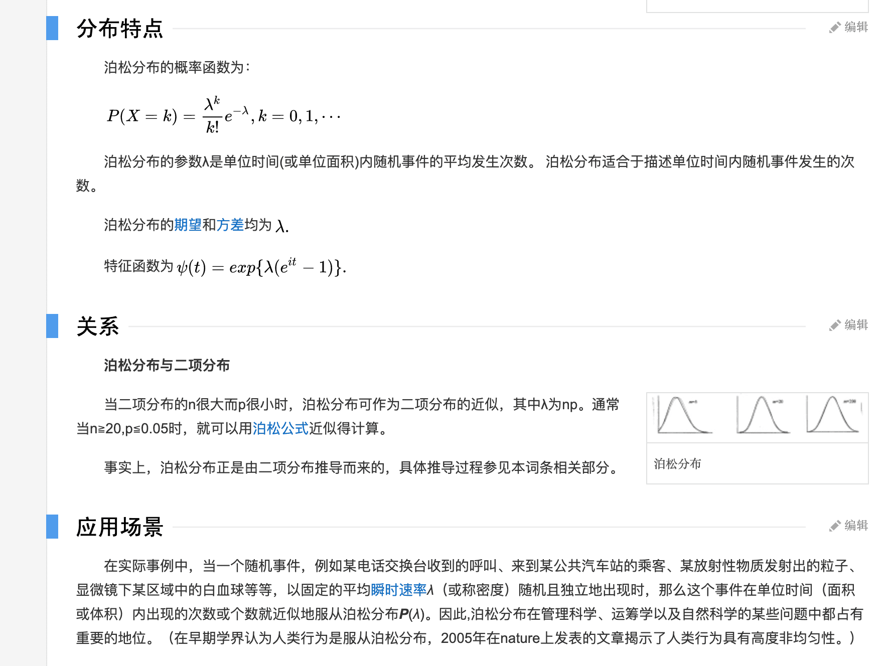
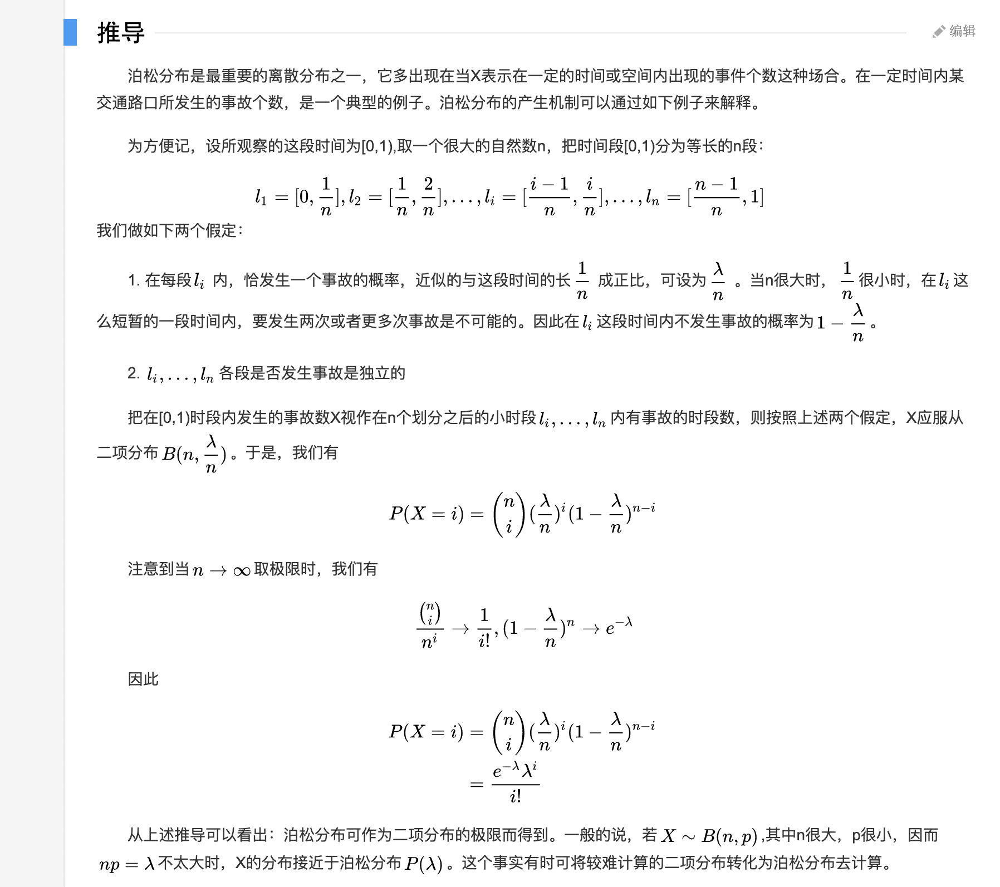

论文中涉及到的数学知识,喜欢刨根究底!!!

自然数e

泊松分布（Poisson distribution）

[泊松分布原文](https://baike.baidu.com/item/%E6%B3%8A%E6%9D%BE%E5%88%86%E5%B8%83/1442110?fr=aladdin)

[二项分布原文](https://baike.baidu.com/item/%E4%BA%8C%E9%A1%B9%E5%88%86%E5%B8%83)

